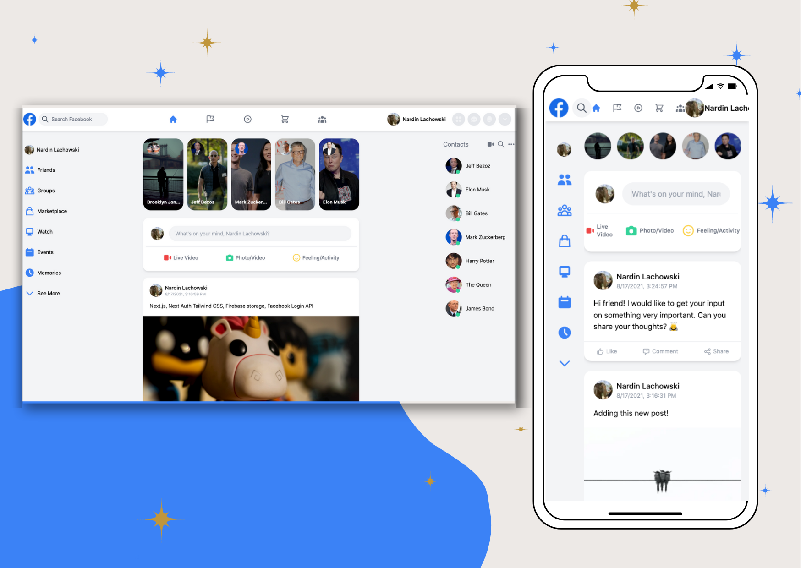

# FACEBOOK CLONE

Facebook clone built with Next.js, Next Auth, Tailwind CSS, Firebase Storage, and Facebook Login API. Web and mobile responsiveness. The application allows a user to create facebook posts that will be saved to the Firebase Storage database and will only be available while logged in through the app. This app is designed to look like the Facebook website but has limited functionality.

Screenshot of application:  

Link to live application: 

## Table of Contents

* [Installation](#Installation)
* [Usage](#Usage)
* [Contributing](#Contributing)
* [Tests](#Tests)
* [License](#License)
* [Questions](#Questions)

## Installation
Feel free to clone the repo or reference the code and remember to install required packages

## Usage
The purpose of this app build is to practice the various technologies utilized. Have fun with it!

## Contributing
We love seeing community contributions to opensource projects! Did I miss something? Want to make a suggestion? Find a spelling mistake? All messages are greatly appreciated! If you would like to contribute, please do.

## Tests
n/a

## License
This project is released under MIT opensource license:

https://opensource.org/licenses/MIT

## Questions
For more about my work, check out my Github profile: https://github.com/nard1n

If you have any questions and would like to chat, please feel free to send me an email directly to nardin.lachowski@gmail.com